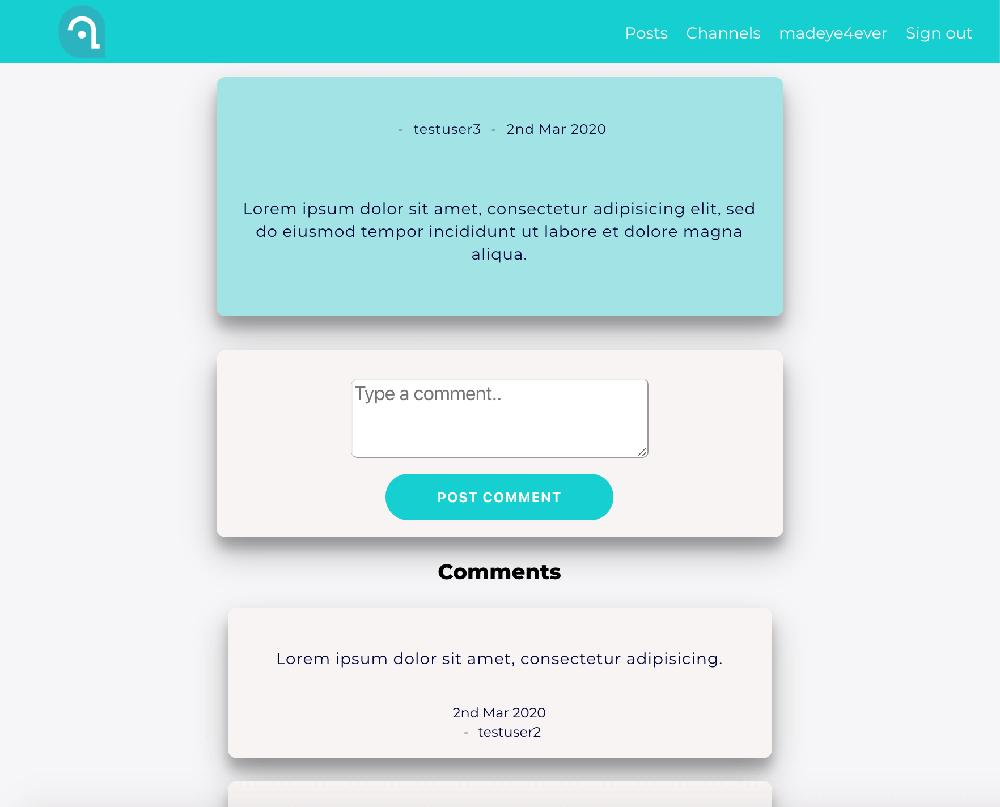
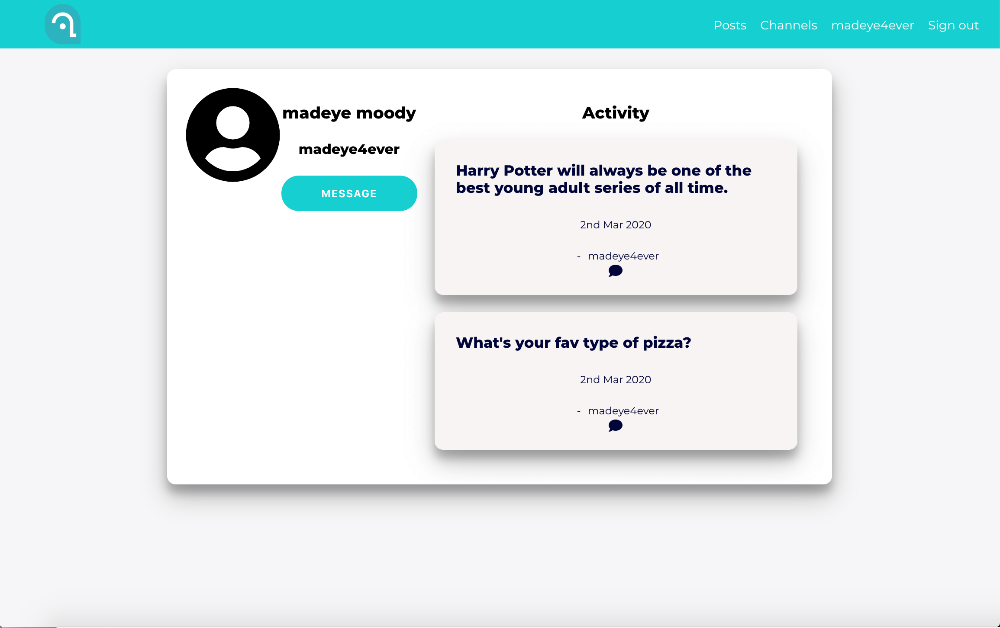

# upLift

## Why upLift

> Education is expensive. Mentorship is expensive. However, both should be easily accessible to everyone who desires knowledge and to grow intellectually.
> At upLift we believe in Denzel Washington's famous quote, 'When you get it, reach back, pull someone else up. Each one, teach one.'
>
> upLift is completely free for all users. Share your knowledge with others by becoming a mentor, or gain knowledge
> from others to help grow in your career or grow your intellectual network.
> The knowledge you can gain and give is limitless.
> [!upLift Landing screen](upLift-Landing.png "Link to upLift landing").

#### Technology Used

> React, JavaScript, CSS, Enzyme, Jest, NPM, RESTFul API, Socket.io
> [Try out upLift](https://secretstash-app.now.sh/home "Link to upLift homescreen").

## Message Mentors and Mentees

> Easily contact your mentors and/or mentees.
> 

### Add Posts

> Easily add a new post to share any knowledge worth writing an article on for other users.
> 

### View a specific post, edit and delete posts and add comments.

> Select a post to view the comments and to add a comment.
> 

### Create a new profile or sign into your account.

> Sign into your existing account or create a new account.
> 
>
> 

### View a user profile.

> View your profile and others.
> 

<!-- ### Edit Posts

> Edit your posts with ease.
>  -->
